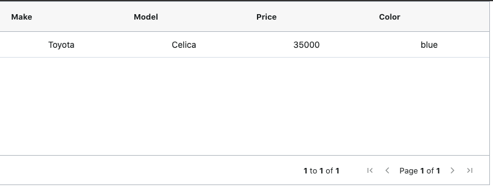

# Help me fix this problem

```
npm install
npm run test
```

There are 2 passing and 3 failing tests in [App.test.js](./src/App.test.js).
```
 FAIL  src/App.test.js
  the tests
    headers
      ✕ renders all the headers (175ms)
    data
      ✓ renders field for make (54ms)
      ✓ renders field for model (49ms)
      ✕ renders field for price (50ms)
      ✕ renders field for color (51ms)
```

I can't figure out anything beyond the 2nd column isn't rendered for react-testing-library.

## Other info
* `npm run start` will show you what the table looks like.

* Here is more info on masterDetail option in ag-grid https://www.ag-grid.com/javascript-grid-master-detail/

* What I thought at first was a loading/timing thing is clearly not, because the test can always find data for the first 2 columns

* Branch `onGridReady` tries to wait until the grid is ready similar to how it is described here https://www.ag-grid.com/javascript-grid-testing-react/

## Screenshot
Nothing fancy!
